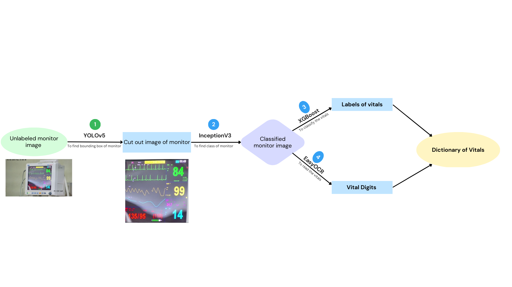

---

# Vital Extraction from ECG Monitor Images

## Abstract
This project automates the extraction of medical vitals from monitor images using a deep learning-based pipeline. The model processes an unlabeled monitor image to output vital signs like heart rate and oxygen levels. Our approach integrates YOLOv5 for monitor detection, InceptionV3 for classification, XGBoost for vital type classification, and EasyOCR for digit recognition. The system delivers reliable accuracy in identifying vitals, with confidence scores ranging from 0.9 to 0.97. The proposed model is scalable and can handle challenges such as variations in monitor angle, shape, and background color.

## Pipeline Overview

1. **Monitor Detection (YOLOv5)**  
   The YOLOv5 model is used to detect and crop out the monitor from an input image. The system identifies the bounding box for the monitor, selecting the one with the highest confidence score.

2. **Monitor Classification (InceptionV3)**  
   Once the monitor is detected, the cropped image is passed to an InceptionV3 model, which classifies the monitor into predefined categories. We introduced K-means clustering to enhance the classification.

3. **Vital Classification (XGBoost)**  
   The positions and sizes of digits from the monitor image are passed to an XGBoost classifier, which predicts the class of each vital (e.g., heart rate, oxygen level) based on the location and appearance of the digits.

4. **OCR for Vital Extraction (EasyOCR)**  
   Finally, EasyOCR is used to extract and recognize the actual digits corresponding to each vital. The results are compiled into a dictionary of vital readings.

## Instructions for Running the Jupyter Notebook

### Setup
The main notebook for this project is `final_pipeline.ipynb`, which is divided into six sections:

1. **Library Installation and Model Loading**: Ensure you run this section to install necessary dependencies and load the pre-trained models.
   
2. **Image Preprocessing**: This section handles image cropping based on the detected monitor.
   
3. **Monitor Classification**: The monitor image is classified here using the InceptionV3-based model.

4. **Vital Classification and OCR**: Vital readings are classified using XGBoost, and the digits are extracted using OCR.

5. **Inference and Digitization**: Provides inference functions for vital detection from new images.
   
6. **Result Display**: Displays the final extracted vitals in dictionary format.

Make sure to upload the models directly to the `/content/` directory in Google Colab. Provide correct paths to the models in the third cell. All cells should be run once to initialize variables and functions.

### Usage
You can pass an image file path as a parameter to the inference functions in the last section to get the vital readings.

## Model Components

### Monitor Segmenter (YOLOv5)
- Trained on 2000 images (1800 for training, 200 for testing) to identify and crop out the monitor from the image.
- **Performance Metrics**:  
   - Precision: 0.991  
   - Recall: 1.0  
   - mAP50: 0.995  
   - mAP50-95: 0.99  

### Monitor Classifier (InceptionV3 + K-Means Clustering)
- Classifies the cropped monitor image into one of four categories.
- The unsupervised K-means clustering approach achieved 100% accuracy on both test and training sets.

### Digit Segmenter (YOLOv5)
- Detects up to six digits per monitor image.
- **Performance Metrics**:  
   - Recall: 0.996  
   - mAP_0.5: 0.994  
   - mAP_0.5-0.95: 0.803  

### Vital Classification (XGBoost)
- The XGBoost classifier predicts the type of vital based on the position and size of detected digits.
- Trained separately for each monitor class.
- **Class Accuracy**:  
   - BPL-Ultima-PrimeD: 100%  
   - BPL-EliteView-EV10-B: 98.69%  
   - BPL-EliteView-EV100: 97.0%  
   - Nihon-Kohden-lifescope: 99%

### OCR (EasyOCR)
- Text recognition from the cropped monitor image.  
- Sharpness adjustment and auto-brightness features were used to improve OCR accuracy.

## Heart Rate Digitization
A separate YOLOv5 model was used to detect and crop the heart rate graph from the monitor image. Contour detection in OpenCV was then applied to extract the graph coordinates, which were plotted using Matplotlib.

## Conclusion
This project demonstrates the potential for accurate vital extraction from low-resource medical settings using open-source models and techniques. Future work may explore zero-shot or few-shot learning to generalize the model across more diverse environments.

## Contact
For any questions or further inquiries, please feel free to reach out to me at _harshit_2101mc20@iitp.ac.in_

---

